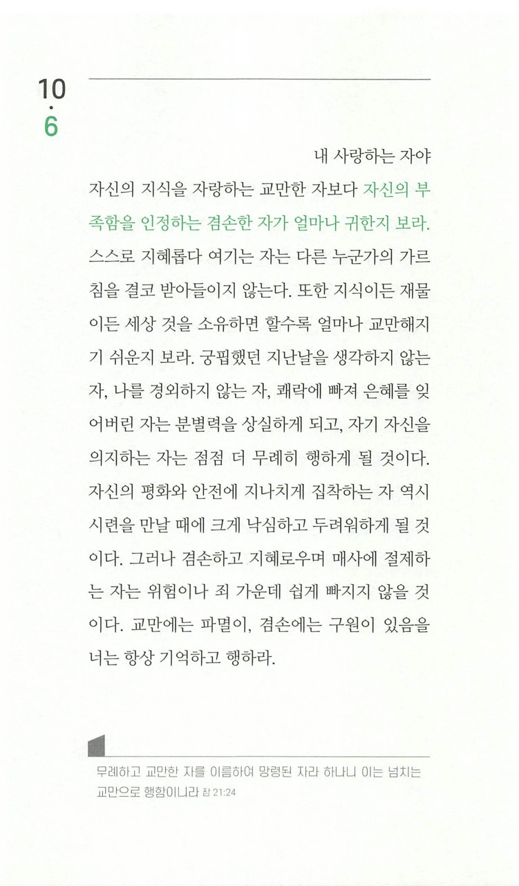

나를 사랑하는 주님,
오늘 하루도 저를 사랑해주셔서 감사합니다.

그와는 반하여 저는 교만함으로 주님의 사랑하심을 수없이 무시해왔습니다.
내 일생을 내가 모두 감당할 수 있을 것이라 확신하며 스스로를 높여왔습니다.
그리고는 속으로, 나는 꽤 착한 사람이라면서 정말 많은 합리화를 했었습니다.

하지만 주님, 주님께서 만드신 이곳은 그렇지 않습니다.
교만하면 교만할 수록 더 어리석어지며,
높아지면 높아질 수록 더 낮아지게 되어있습니다.

제가 아무리 발버둥을 치더라도,
주님께서 허락지 않으시면 아무것도 할 수 없는 사람일 뿐입니다.

주님, 제가 교만에 빠져 주님을 의지하지 않고 다른 것에 의존하려 한다면 돌이켜 주세요.
아무것도 모르고 유괴범에게 따라가는 아들을 다급히 불러 세우는 아버지와 같이,
부디 지켜주세요.
더 이상 사단의 교만한, 음란한, 우울한 속삭임에 지고싶지 않습니다.
주님의 넓으신 품으로 저를 품어주세요.
