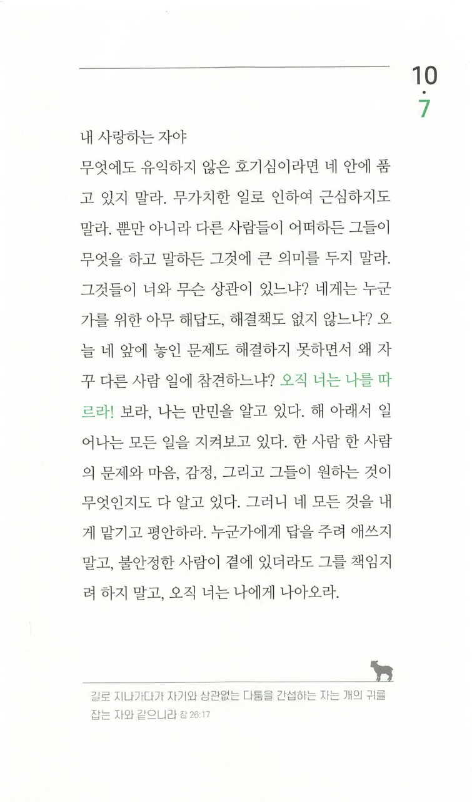

주님, 너무도 부끄럽습니다.

저는 항상 “한번쯤은 해봐야 하는건 해봐야지”라는 생각을 가지고 쓸데없는 호기심을 가지고 있던 것 같습니다.
그것이 세상의 기준임에도 불구하고요.

또한 나의 기준을 내 주변사람들의 눈치와 기준에 맞추며 살아가고 있었습니다.
주님에게만 보기 좋으시다면 충분한데도 불구하고요.

“지극히 작은 자에게 한 것이 곧 내게 한 것이라” 라는 말씀 하나만 가지고,
불안정한 사람을 책임지는 것이 주님의 뜻인 것 마냥 행동했습니다.
제 삶에 있어 주님과의 깊은 관계를 가지는 것이 가장 중요한데도요.

주님, 그것 조차 죄 임에도 죄인줄 알지도 못하고 있었습니다.
정말로, 주님 한분만으로도 충분한 사람이 되고싶습니다.
그 이외의 것에 눈길 조차 주지 않는 사람이 되고싶습니다.
“남들은 다 하는데, 나도 해야하지 않겠어?” 라는 생각을 끊어내고 싶습니다.
오직 주님만 생각나도록, 주님이 내 기준 되도록
주님의 사랑으로 저를 구속하여주시옵소서.
