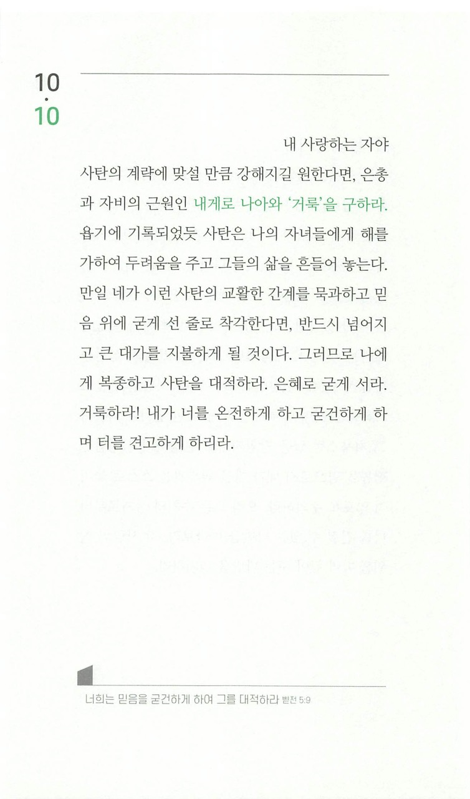

주님! 오늘 하루도 함께 해주셔서 감사합니다.

오늘 4시간 가량 혼자 운전을 하면서 많은 생각들을 했습니다.  
요즘 주님께서 약간의 휴식을 허락하셔서 제 자신을 돌아볼 시간을 가질 수 있었습니다.  
그러다 문득 "이웃을 네 몸과 같이 사랑하라" 하신 말씀과 "자기를 부인하고 자기 십자가를 지고 나를 따르라" 하신 말씀이 뭔가 모순되는 것 같다고 생각하고 있었습니다.  
'자기 자신을 사랑한다면 자기를 부인할 수 없는거 아닌가?'하고요.

하지만 조금만 생각해보니 그것이 아니었음을 알 수 있었습니다.  
저희는 주님이 창조하신 피조물이며,  
어떤 상황이든 주님이 허락지 않으시면 이루어지지 않습니다.  
그렇기에 저희는 주님을 의지할 수밖에 없는 작은 존재임을 인정해야 합니다.

물론 제 자신만 그런 것이 아니라 타인에게도 똑같이 적용되는 사실이기에,  
이렇게 낮은 위치에 있는 저희는 서로를 미워할 이유가 없어서 사랑하는 것입니다.  
서로를 보살펴줘도 모자를 판에, 미워하다니요. 그것이야말로 사탄이 원하는 것 아니겠습니까.

자기 자신을 부인하라 하신 말씀도  
저희가 낮은 자이기에 제 마음의 중심에서 내려와 하나님의 뜻에 온전히 순종하는 것을 말씀하신 것이겠지요.

그런데 저도 여기까지만 생각하고 제 자신이 너무 하찮고 보잘것 없이 보여서 우울해질 때가 많았습니다.

하지만 주님께선 이걸로 끝내지 않으시고 "자기를 낮추는 자는 높아지리라."고 말씀해주셨습니다.  
그리고 저희를 끝까지 사랑해주신다고도 말씀해주셨습니다.

주님, 지금껏 열등감에 싸여 저를 방치해두었었습니다.  
하지만 오늘부터라도 저를 사랑하셔서 만들어주신 제 자신을 좀 더 사랑해보겠습니다.  
또 그것보다 더욱 주님을 사랑해보겠습니다!

다시 한번 주님만으로 충분한 사람이 되도록 앞길을 인도하여주세요!
