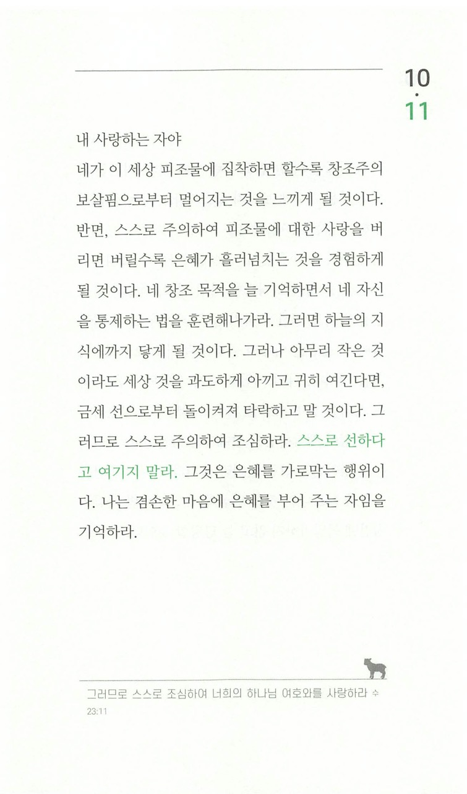

주님, 보물이 있는 곳에 마음이 있다고 하셨습니다.  
여기서 말씀하신 보물은 금전적인 것 뿐만 아니라 제 시간과 노력을 쏟은 것이기도 하겠지요.  
제가 아직도 주님께 온전히 집중하지 못하는 이유가 이것인 것 같습니다

주님, 저는 저의 피조물을 너무 사랑합니다.  
누군가 그 피조물을 망가뜨리려 한다면 화를 내기도 하고 화를 내지 않더라도 앙심을 품기 마련이었습니다.  
하지만 주님, 제게 피조물이란 개념이 있기나 할까요?  
전부터 계속 고백해왔지만, 주님 없이는 된 것도, 만들어진 것도 없습니다.  
이것 또한 교만이었죠.

내 삶의 모든 것들이 주님의 것이고, 주님 앞에 내려놓겠습니다!  
주님, 주님을 더욱 의지하는 마음으로 더욱 겸손해지길 원합니다!
