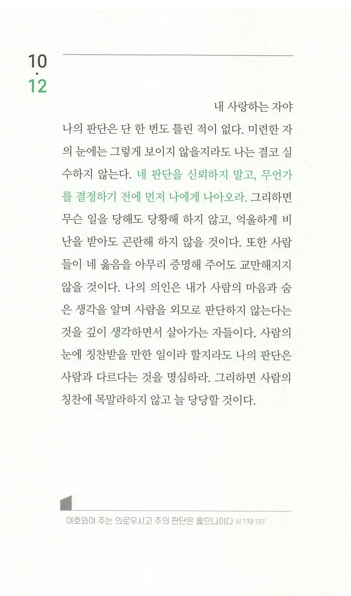

주님, 제가 살아가는 이 삶은 항상 결정과 선택의 연속입니다.  
정말 사소한 것 하나하나의 선택이 제 삶을 만들어 갑니다.  
그만큼 제가 하는 모든 선택들이 제 삶에 있어서 중요한 것들입니다.  
그런 선택들을 불완전한 제 스스로에게 맡기면 제 삶도 불완전해지기 마련입니다.

주님, 지금껏 제 삶을 제가 선택해왔기에 그리 불안하고, 칭찬에 목말라하고, 외로웠는지요?  
만약 그랬다면, 지금부터라도 모든 선택들을 주님께 맡겨보고 싶습니다.

하지만 어떻게 해야하는건지 잘 모르겠습니다.  
기도를 한다고 해서 주님께서 말씀하는 것이 제 머리 속에 들리는 것이 아니잖습니까?  
아무리 기도 중에 마음이 감동이 된다 하더라도, 저는 아직 그것이 저만의 생각인지, 주님이 주신 마음인지 구별하기도 쉽지 않습니다.

그저 지금까지 제가 이해한 바로는 "예수님이라면 어떻게 했을까?" 한번 생각해보는 것과  
매일의 묵상과 기도로 제 생각이 주님의 생각과 가까워지는 방법 뿐입니다.  
이것이 맞는지요? 아니면 주님의 음성을 더 확실하게 들을 수 있는 다른 방법이 있는지요?

일단, 이 두 가지 방법을 오늘부터라도 실천해보겠습니다.  
아직 어리석고, 저 밖에 모르는 사람이지만, 아는 것 하나 없는 사람이지만, 그렇다고 가만히 있을 수는 없습니다.  
제가 잘못된 길로 가고 있다면, 주님께서 제 삶에서 나타내주시고 인도하여주시옵소서.  
그렇게 인도해주실 주님을 믿고, 계속 시도해보겠습니다.  
주님 이 모습을 긍휼이 여겨주시고, 끝까지 함께 해주시옵소서.
