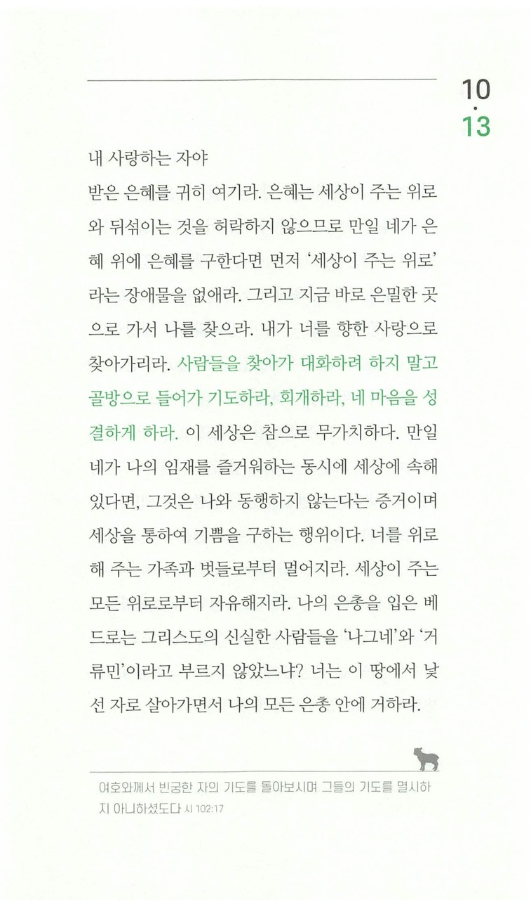

오늘도 어김없이 저를 사랑하시고, 새로운 말씀으로 저를 깨워주시니 감사합니다.

주님, 저는 참으로 이중적인 삶을 살아가고 있는 것 같습니다.  
교회에서, 또 교회 사람들과 있을 때는 거룩한 양, 깨달음을 얻은 양, 무언가 결심한 양 나타내지만,  
교회를 나오고 나서의 저의 삶은 그저 이전과 다를 바 없고 거룩함은 세상 사람들과 다를 바 없으며,  
교회에서 한 결심은 어디가고 또 다시 죄의 자리로 돌아가고 있습니다.  
그리고 저는 또 '주님과의 신뢰를 저벼렸어...' 하며 자책할 때가 한두번이 아닙니다.  
가끔은 그 죄책감이 너무도 심해서 주님께 나아가는 것 조차 주저할 때가 많습니다.  
그것 때문일까요, 그러면서 주님이 아닌 바로 눈앞에서 위로를 해주는 사람을 의지하게 되어버리는 것 같습니다.

주님, 주님은 저를 끝없이 사랑하시는데, 제가 주님을 사랑하는건 왜이리 어려울까요.  
분명 주님을 사랑하고 있다면, 주님의 사랑에 보답하고 싶다면, 이러지 않을텐데요.  
제가 진정으로 주님을 사랑하긴 하는건지, 주님이 계신걸 믿고는 있는건지 혼란스러울 때가 많습니다.

하지만 주님, 어제 제게 말씀해주신 것처럼  
주님은 이런 저의 약한 모습, 의심이 많은 모습, 죄책감에서 허덕이는 모습을 너무나도 잘 알고 계시고  
그것을 이해하시며, 그런 제 모습 조차 사랑하시고 품어주십니다.  
오히려 솔직하게 저의 이런 모습을 인식하고 주님께 털어놓는 것을 기뻐하신다고 하셨습니다.

주님 저의 모습은 기드온과 같이 한없이 불완전하지만  
주님이 완전하시고 그 주님이 함께하심으로 비로소 저도 완전해질 수 있습니다.  
주님께서 저의 약함을 이해하시나 전혀 생각지 않으시고,  
함께하심으로 저를 강하게 하시며 기적을 일으키십니다.  
이런 "사실"을 제 생각뿐이 아닌 제 몸 전부가 느끼고 제 삶에 적용되길 원합니다.

저 또한 주님만으로 충분하고, 사람을 의지하고 싶지 않습니다.  
사람을 의지하고 또 그 의지의 대상이 사라지는 순간 얼마나 상심이 큰지 알게되었으니까요.  
영원히 계신 주님을 의지하고 싶습니다.

주님 그것을 위해서 제가 할 수 있는 것이라곤  
이렇게라도 주님을 생각하고 찾는 방법밖에는 모르겠습니다.  
하지만 이 방법이라도 끝까지 물고 늘어져볼테니,  
주님 계속 지켜봐주시고 저의 앞길을 예비해주시옵소서!
